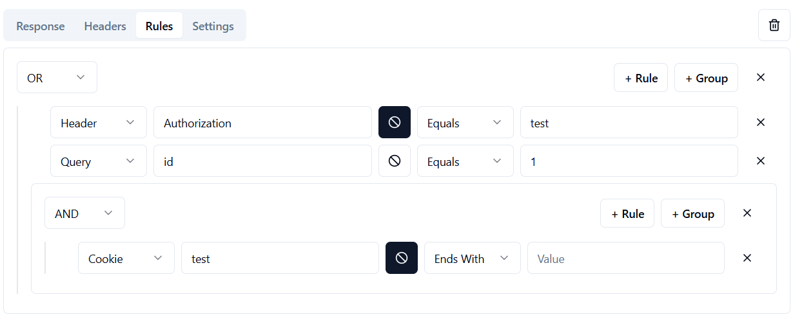

# Maboroshi

## 🧭 Introduction
**Maboroshi** is a flexible ASP.NET Core + React application that allows you to **design and simulate mock API routes** with configurable behaviors, templates, and rule-based responses. It is ideal for frontend/backend development, testing, and prototyping scenarios.

- **Backend:** ASP.NET Core 8.0
- **Frontend:** React + TypeScript + Vite
- **Features:** Route-based mock engine, templated responses, rule evaluation, sequence/randomized behaviors

---

## 🚀 How to Run

### 🖥️ Run locally (Dev mode)
```bash
# from repo root
cd Maboroshi.Web

# starts backend (will proxy to frontend if configured)
dotnet run
```
React dev server will start automatically if configured with `<SpaProxyLaunchCommand>` in `.csproj`.

### 🐳 Run in Docker (Production)
```bash
# build image
docker build -t maboroshi-app .

# run container
docker run -d -p 8080:8080 --name maboroshi maboroshi-app
```
App will be available at: `http://localhost:8080`

---

## 🛣️ Routing
Routing follows the standard ASP.NET Core endpoint routing engine.

- ✅ Supports `/api/items/{id}`
- ✅ Optional segments: `/api/items/{id?}`
- ✅ Regex constraints: `/api/{name:regex(^[a-z]+$)}`
- ✅ Wildcards: `/api/{**slug}`

**Important:**
- Routes are declared **in order**, and the **first match wins**.
- If multiple routes share the same path, only the **first** will be evaluated.
- If you want alternate behaviors for the same route, **add multiple responses** to a single route.

---

## 📦 Responses
Each route can define multiple responses. The server will select the correct response based on the response **mode**:

- `random` → Picks one at random
- `sequence` → Cycles through responses one-by-one
- `default` → Uses rule engine (see below); if none match, picks the **first** response

---

## 📐 Rules

Maboroshi's rule engine enables **conditional response selection** based on incoming request data. Rules can be defined per response and grouped for more complex logic.

### 🧩 Rule Types

Each rule checks a part of the request and compares it to a defined value using an operator. In the UI, you can:

- Define a **Simple Rule**, which checks a single condition
- Or define a **Group of Rules** (e.g., "All must match", "Any must match")

### 🛠️ Rule Structure

Each rule consists of:

- **Type**: What part of the request to inspect
  - `query` – Matches query string parameters (`/api/items?id=123`)
  - `header` – Matches HTTP headers (`Authorization: Bearer ...`)
  - `route` – Matches route parameters (`/api/items/{id}`)
  - `cookies` – Matches cookie values
  - *(Coming Soon)* `body` – Will support inspecting JSON payloads

- **Key**: The name of the parameter (e.g., `id`, `Authorization`, etc.)

- **Key**: Negate

- **Operation**: How the key's value is evaluated
  - `equals` – Exact match
  - `contains` – Substring or partial match
  - `starts with`
  - `end with`

Below is an example of the rule editor interface:



---

## 🧬 Templating
You can write dynamic response bodies using `{{ expression }}` syntax. Maboroshi uses a custom Handlebars-like engine.

Expressions support:
- Literals: 'hello', 12
- Function calls: `{{ now }}`, `{{ lowercase 'HELLO' }}`
- Blocks: `{{#repeat 3}}...{{/end}}`

### 🔁 Array Helpers
| Helper     | Description                            |
|------------|----------------------------------------|
| `array`    | Create array: `{{array (1 2 3)}}`        |
| `oneOf`    | Pick one: `{{oneOf (array (1 2 3))}}`    |
| `someOf`   | Pick multiple: `{{someOf (array (1 2 3)) 1 2)}}` |
| `join`     | Join values: `{{join (array 1 2 3) ','}}` |
| `slice`    | Sub-array: `{{slice (array 1 2 3) }}` |
| `sort`    | Sort array: `{{sort (array 1 2 3) 'asc' }}` |
| `reverse`    | Reverse array: `{{reverse (array 1 2 3) }}` |

#### 🔤 String Helpers

| Helper      | Description                                |
|-------------|--------------------------------------------|
| `lowercase` | `{{ lowercase 'HELLO' }}`        |
| `uppercase` | `{{ uppercase 'hello' }}`       |
| `substr`    | `{{ substr 'hello' 0 1? }}`             |
| `split`     | `{{ split 'hello world' ' '? }}`             |
| `includes`  | ` {{ includes 'hello' 'll' }}` |

#### ➗ Math Helpers

| Helper      | Description                        |
|-------------|------------------------------------|
| `add`       | `{{ add 2 3 }}`              |
| `subtract`  | `{{ subtract 5 2 }}`         |
| `multiply`  | `{{ multiply 4 2 }}`      |
| `divide`    | `{{ divide 10 2 }}`        |
| `modulo`       | `{{ mod 7 3 }}`              |
| `ceil`     | `{{ ceil 2.3 }}`                              |
| `floor`    | `{{ floor 2.9 }}`                              |
| `round`    | `{{ round 2.6 }}`                            |
| `toFixed`  | `{{ toFixed 3.14159 2 }}`                 |
| `eq`       | `{{ eq 5 5 }}`                             |
| `gt`       | `{{ gt 6 3 }}`  (greater than)               |
| `gte`      | `{{ gte 6 6 }}` (greater than or equal)     |
| `lt`       | `{{ lt 3 6 }}` (less than)                  |
| `lte`      | `{{ lte 3 3 }}`  (less than or equal)        |

#### 👤 Faker (Fake Data Generator)

Maboroshi integrates **Faker** as a wrapper over [Bogus (.NET)](https://github.com/bchavez/Bogus?tab=readme-ov-file#bogus-api-support), providing realistic dummy data generation.

Generic call: `{{ faker 'internet.email' }}` → `john.doe@example.com`

Or use **shortcut helpers** for convenience:

| Shortcut       | Description                          | Equivalent Faker Path             |
|----------------|--------------------------------------|-----------------------------------|
| `int`          | Random integer                       | `number`                          |
| `float`        | Random floating-point number         | `float`                           |
| `boolean`      | Random true/false                    | `bool`                            |
| `title`        | Job title                            | `name.jobtitle`                   |
| `firstName`    | First name                           | `name.firstname`                  |
| `lastName`     | Last name                            | `name.lastname`                   |
| `company`      | Company name                         | `company.companyname`             |
| `domain`       | Domain name                          | `internet.domainname`             |
| `tld`          | Top-level domain (e.g., `.com`)      | `internet.domainsuffix`           |
| `email`        | Email address                        | `internet.email`                  |
| `street`       | Street name                          | `address.streetname`              |
| `city`         | City name                            | `address.city`                    |
| `country`      | Country name                         | `address.country`                 |
| `countryCode`  | Country code                         | `address.countrycode`             |
| `zipcode`      | Postal code                          | `address.zipcode`                 |
| `postcode`     | Postal code (alias of `zipcode`)     | `address.zipcode`                 |
| `lat`          | Latitude                             | `address.latitude`                |
| `long`         | Longitude                            | `address.longitude`               |
| `phone`        | Phone number                         | `phone.phonenumber`              |
| `color`        | Random color name                    | `internet.color`                  |
| `hexColor`     | Hexadecimal color code               | `internet.color`                  |
| `guid`         | GUID                                 | `guid`                            |
| `uuid`         | UUID                                 | `uuid`                            |
| `ipv4`         | IPv4 address                         | `internet.ip`                     |
| `ipv6`         | IPv6 address                         | `internet.ipv6`                   |
| `lorem`        | Lorem ipsum text                     | `lorem.text`                      |

#### 📥 Request Data Helpers

These helpers allow you to extract values directly from the incoming HTTP request and use them in dynamic responses.

| Helper         | Description                                         |
|----------------|-----------------------------------------------------|
| `queryParam`   | Get query string parameter: `{{ queryParam 'id' }}` |
| `urlParam`     | Get route/URL parameter: `{{ urlParam 'id' }}`      |
| `cookieParam`  | Get cookie value: `{{ cookieParam 'session' }}`     |
| `headerParam`  | Get HTTP header: `{{ headerParam 'Authorization' }}`|
| `hostname`     | Get request hostname                                |
| `ip`           | Get client IP address                               |
| `method`       | Get HTTP method (e.g., GET, POST)                   |

Examples:
```
{{ var 'count' 5 }}
{
  "Template example":  "This is an example of the template",
  "total": {{ @count }},
  "users": [
   {{ #repeat @count ',' }}
     {
        "userId": {{ uuid }},
        "firstName": {{ firstname }},
        "lastName": {{ lastName }},
        "phoneNumber": {{ faker 'phone.phonenumber' }},
        "friends": [
            {{ #repeat (number 3 6 ) ',' }}
               {
                 "id": {{ uuid }}
               }
            {{ /end }}
         ]
     }
   {{ /end }}
  ]
}
```